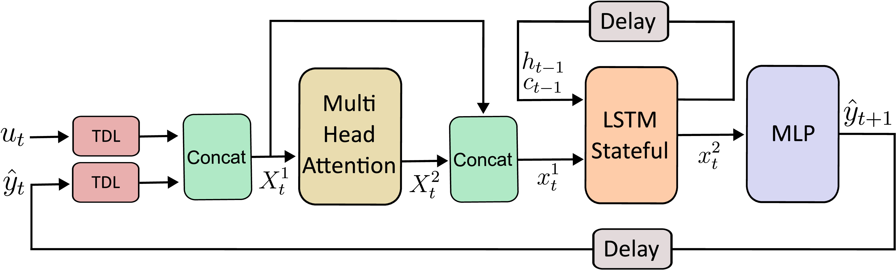
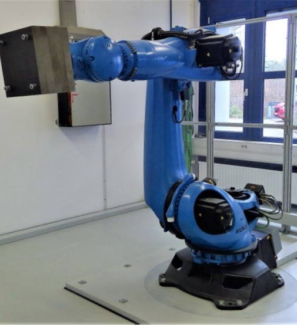
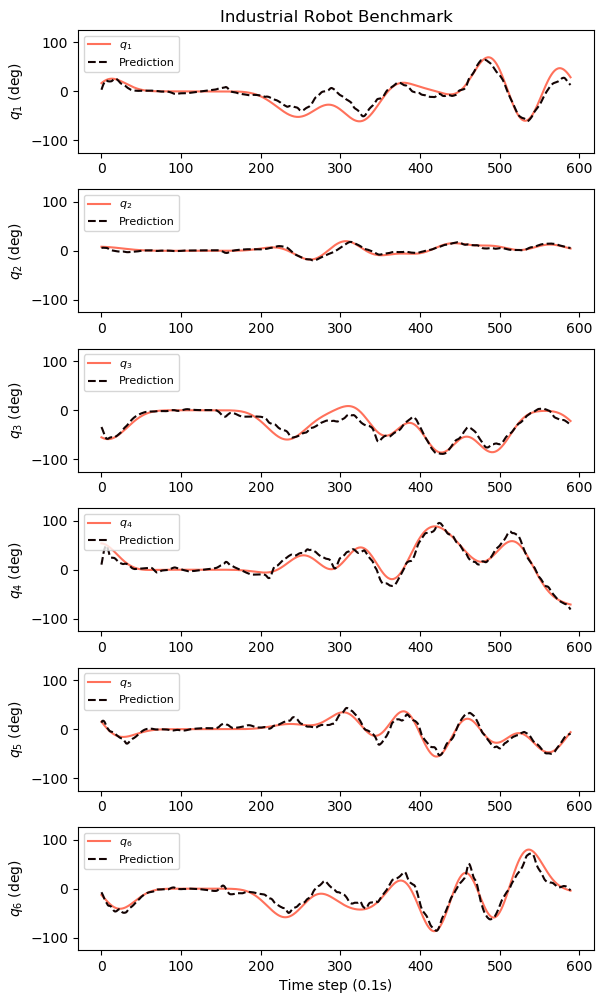

# MA-LSTM-MLP: Dynamical System Simulation with Attention and Recurrent Neural Networks

## Table of Contents
- [Overview](#overview)
- [Requirements](#requirements)
- [Project Structure](#project-structure)
- [Datasets](#datasets)
- [Usage](#usage)
- [Citation](#citation)
- [License](#license)
- [Contact](#contact)

## Overview
Accurate and efficient real-time simulation of nonlinear dynamic systems remains an important challenge in fields such as robotics, control systems and industrial processes, requiring innovative solutions for predictive modeling. In this project, we introduce a novel recurrent neural network (RNN) architecture designed to simulate complex nonlinear dynamical systems. Our approach aims to predict system behavior at any time step and over any prediction horizon, using only the system's initial state and external inputs. 

The proposed architecture combines RNN with multilayer perceptron (MLP), and incorporates an attention mechanism to process both previous state estimates and external inputs. By [training without teacher forcing](https://doi.org/10.1109/ACCESS.2024.3504724), our model can iteratively estimate the system's state over long prediction horizons.



This is a diagram of the MA-LSTM-MLP architecture. Consider the estimated state of a system at time step $t$ as $\hat{y}_t\in \mathbb{R}^{m}$ and the control inputs at $t$ as $u_t \in \mathbb{R}^{n}$.
 
## Requirements

This project has been realized with Python 3.6.8 and the following [libraries](requirements.txt):
- **TensorFlow** == 2.6.2
- **Keras** == 2.6.0
- **NumPy** == 1.19.5
- **Pandas** == 1.1.5
- **Matplotlib** == 3.0.3
- **scikit-learn** == 1.5.1

We tested the code with a NVIDIA GeForce GTX Titan XP using CUDA Toolkit 11.4

## Project Structure

Here is a list of the main files and directories included in the project, along with a brief description of what each one does:

- `ma_lstm_mlp.py`: Main Script for Training and Testing the MA-LSTM-MLP on Datasets of Dynamical Systems.
- `datasets/`: Directory that contains datasets and pre-trained models for each example.
    - `robot/`: Directory for the Industrial Robot dataset.
        - `losses/`: Contains the loss values of the trained models.
        - `networks/`: Trained models.
        - `series/`: Industrial Robot dataset.
    - ... Same structure for each dataset.
- `libs/`:
    - `config.py`: Configuration and hyperparameters of all the Datasets and Networks.
    - `data.py`:  Functions for Preprocessing Dynamical Systems Datasets.
    - `metrics.py`: Metrics and Loss Functions used during Training and Testing.
    - `network.py`: Class for Training and Testing the MA-LSTM-MLP on Datasets of Dynamical Systems.
    - `plot.py`: This file defines functions to plot the loss evolution during training with and without teacher forcing, calculate and print various performance metrics, and visualize the prediction results for the different datasets.
- `requirements.txt`: List of Python dependencies required to run the project.
- `README.md`: The readme file you are currently reading.
- `LICENSE`: The license file for the project.

## Datasets

This repository includes two configured datasets, with which you can train models or test pre-trained models. The datasets are public and can be found together with more information in the following links:
- [Industrial Robot](https://www.nonlinearbenchmark.org/benchmarks/industrial-robot)
- [Wiener-Hammerstein Process Noise System](https://www.nonlinearbenchmark.org/benchmarks/wiener-hammerstein-process-noise)

To visualize the format of the datasets compatible with this code, let's take [Industrial Robot](https://www.nonlinearbenchmark.org/benchmarks/industrial-robot) as an example. This dataset consists of data collected from a KUKA KR300 R2500 ultra SE industrial robot, similar to the one shown in the figure below. The dataset has 43,622 time steps with a sampling rate of 10 Hz. At each time step $t$, we have as control input $u_t$ the six motor torques $\tau$ (Nm), where $n = 6$. The state $y_t$ contains the six joint angles $q$ (deg), where $m = 6$. The test data consists of 3,635 time steps. The remaining 39,987 time steps have been divided, using 36,387 for training and 3,600 for validation.

<p align="center">
  
</p>

The series are loaded in CSV format. Let's look at the lines [100-105] of [robot_1.csv](datasets/robot/series/robot_1.csv):

| $\tau_1$ | $\tau_2$ | $\tau_3$ | $\tau_4$ | $\tau_5$ | $\tau_6$ | $q_1$  | $q_2$ | $q_3$  | $q_4$  | $q_5$  | $q_6$  |
|----------|----------|----------|----------|----------|----------|--------|-------|--------|--------|--------|--------|
| -2.99    | -5.11    | -11.35   | -1.97    | -0.40    | -1.50    | -31.70 | 3.59  | -31.36 | -57.93 | 36.65  | -8.99  |
| -2.89    | -4.98    | -11.13   | -1.97    | -0.40    | -1.54    | -32.94 | 3.67  | -32.20 | -59.42 | 37.59  | -10.66 |
| -2.83    | -4.88    | -10.95   | -1.93    | -0.41    | -1.59    | -34.15 | 3.74  | -33.00 | -60.81 | 38.51  | -12.44 |
| -2.78    | -4.79    | -10.82   | -1.88    | -0.42    | -1.62    | -35.34 | 3.81  | -33.75 | -62.11 | 39.38  | -14.31 |
| -2.67    | -4.68    | -10.68   | -1.87    | -0.44    | -1.65    | -36.50 | 3.88  | -34.46 | -63.29 | 40.22  | -16.28 |
| -2.51    | -4.55    | -10.45   | -1.89    | -0.46    | -1.67    | -37.63 | 3.95  | -35.11 | -64.36 | 41.02  | -18.35 |


At a time step $t$, the control inputs $u_t = [\tau_1, \tau_2, \tau_3, \tau_4, \tau_5, \tau_6]$ represent the torques (Nm) applied to the motors. The system state $y_t = [q_1, q_2, q_3,q_4, q_5, q_6]$ includes the joint angles (deg). 

As can be seen, all CSVs used in this project have the same format: The first $n$ columns are $u_t$ and the next $m$ columns are $y_t$. The $n$ and $m$ parameters, as well as the rest of the parameters related to data preprocessing, are easily configured in the script [config.py](/libs/config.py) for each of the datasets.


## Use Other Datasets

The project is prepared so that including other datasets is a simple task. You need to follow these steps:
1. **Prepare the data**: Ensure your dataset is clean, properly formatted and suitable for the MA-LSTM-MLP. 
    - All series must be in CSV format as detailed in the previous section. Where the first $n$ columns will represent $u$ and the next $m$ will be $y$, each row being a time instant.
    - Save series in `datasets/your_dataset/series`
2. **Configure the dataset and network**: Modify [config.py](/libs/config.py) adding your_dataset:
    - Take as example the other two datasets. In this file you can configure the parameters related to how the data will be treated as well as choose the hyperparameters of the MA-LSTM-MLP.
3. **(Optional) Plotting**: Modify [plot.py](/libs/plot.py) adding your_dataset:
    - By default, MA-LSTM-MLP will calculate performance [metrics](/libs/metrics.py) for each of the state parameters. It will show the average results for all test series as well as for individual examples. But it will not show plots with the network predictions next to the ground truth. 
    - Plots can be easily implemented in [plot.py](/libs/plot.py), using the other datasets as examples. 


## Usage

Using [ma_lstm_mlp.py](ma_lstm_mlp.py) to train and test models is very simple. Use the following command:

``
python ma_lstm_mlp.py <dataset> <train|test>
``

The script requires two command line arguments:

1. `<dataset>`: The name of the dataset to be used.
2. `<train|test>`: Specifies the mode of operation. Use train to train the model and test to evaluate the model.

Note that by choosing train, the hyperparameters and configuration chosen in [config.py](/libs/config.py) are used for `<dataset>`. In test mode, it is necessary to have previously trained a model with the current configuration described in the configuration file.

Using `python ma_lstm_mlp.py <dataset> <train>` a model is trained with the `<dataset>` series with the configuration of [config.py](/libs/config.py). Once the training is finished, in `<datasets/<dataset>/losses` you will find the training and validation loss data. In `datasets/<dataset>/networks` you will find the trained model.

Plot and metrics of an example of a test series after running `` python ma_lstm_mlp.py robot test`` with the pre-trained example model:
<p align="center">
  
</p>

**Normalized Root Mean Squared Error (NRMSE):**
- `y_1 = 0.0968`
- `y_2 = 0.0893`
- `y_3 = 0.1031`
- `y_4 = 0.0571`
- `y_5 = 0.0762`
- `y_6 = 0.068`
- **All = 0.0818 ± 0.0162**

**Root Mean Squared Error (RMSE):**
- `y_1 = 12.6329`
- `y_2 = 3.3481`
- `y_3 = 9.7791`
- `y_4 = 9.086`
- `y_5 = 7.0257`
- `y_6 = 11.3107`

**Coefficient of Determination (R²):**
- `y_1 = 0.8248`
- `y_2 = 0.8124`
- `y_3 = 0.8769`
- `y_4 = 0.9159`
- `y_5 = 0.8759`
- `y_6 = 0.8785`
- **All = 0.8641 ± 0.0352**

The pre-trained model is a fast example, feel free to try different hyperparameter configurations or different datasets!

## Citation

### MA-LSTM-MLP Architecture

This repository is part of a paper for the journal *Neural Computing and Applications*. Please, cite as:  

J. Fañanás-Anaya, G. López-Nicolás and C. Sagüés, “Dynamical system simulation with attention and recurrent neural networks,” *Neural Comput & Applic*, Dec. 2024, doi: [10.1007/s00521-024-10732-y](https://doi.org/10.1007/s00521-024-10732-y)

```bibtex
@article{MA-LSTM-MLP-2024,
  author    = {Fañanás-Anaya, Javier and López-Nicolás, Gonzalo and Sagüés, Carlos},
  title     = {Dynamical system simulation with attention and recurrent neural networks},
  journal   = {Neural Computing and Applications},
  year      = {2024},
  month     = {Dec},
  doi       = {10.1007/s00521-024-10732-y}
}
```

### Training Algorithm

The training algorithm used in this work is part of a paper for the journal *IEEE Access*. If you use this training algorithm, please cite it as:

J. Fañanás-Anaya, G. López-Nicolás, C. Sagüés and S. Llorente, “Food Cooking Process Modeling With Neural Networks,” *IEEE Access*, vol. 12, pp. 175866–175881, 2024, doi: [10.1109/ACCESS.2024.3504724](https://doi.org/10.1109/ACCESS.2024.3504724).

```bibtex
@article{training-algorithm-2024,
    author = {Fañanás-Anaya, Javier and López-Nicolás, Gonzalo and Sagüés, Carlos and Llorente, Sergio},
	title = {Food Cooking Process Modeling With Neural Networks},
    journal = {IEEE Access},
    year = {2024},
	volume = {12},
    pages = {175866--175881},
	doi = {10.1109/ACCESS.2024.3504724},
}
```

## License
This project is licensed under the GNU General Public License v3.0. You can find the full text of the license in the [LICENSE](LICENSE) file or visit the [GNU website](https://www.gnu.org/licenses/gpl-3.0.en.html) for more details.

## Contact

Feel free to contact [Javier Fañanás Anaya](https://github.com/javierfa98) for any questions or issues found with the code.
